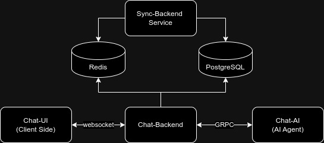

# Sync-Backend
A Synchronization worker for `Chat-Backend`. It takes data from redis streams and update it in postgres database to maintain database and cache consistency.

## System Flow Diagram




## Services

- [Chat-AI](https://github.com/AI-at-Work/Chat-AI-Service)
- [Chat-UI](https://github.com/AI-at-Work/Chat-UI)
- [Chat-Backend](https://github.com/AI-at-Work/Chat-Backend)

## Getting Started

1. Clone the repository:
   ```bash
   git clone https://github.com/AI-at-Work/Sync-Backend
   cd Sync-Backend
   ```

2. Copy the `.env.sample` to `.env` and configure the environment variables:
   ```bash
   cp .env.sample .env
   ```
   Edit the `.env` file to set your specific configurations.

3. Start the service:
   ```bash
   docker compose up -d --build
   ```

## Configuration

Key configuration options in the `.env` file:

- `DB_*`: PostgreSQL database configurations
- `REDIS_*`: Redis configurations

Refer to the `.env.sample` file for a complete list of configuration options.

